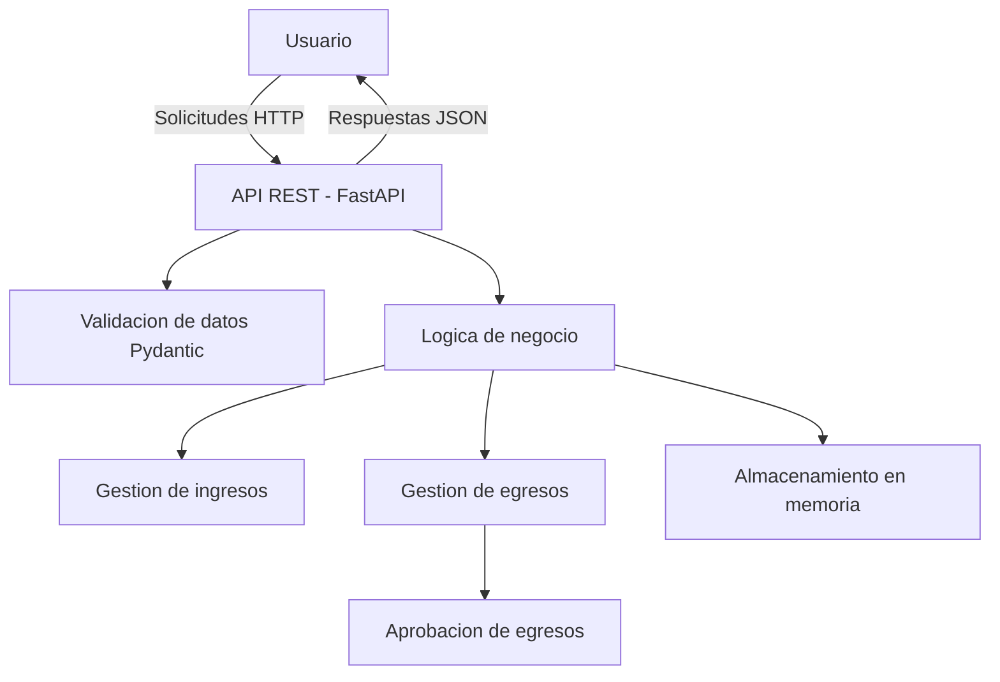

# Arquitectura del Sistema

## Descripción de la Arquitectura

SIMAF está basado en una arquitectura cliente-servidor utilizando una API REST desarrollada con FastAPI. Esta arquitectura permite separar la capa de presentación del procesamiento de datos, facilitando la escalabilidad y el mantenimiento del sistema.

El sistema expone endpoints HTTP que permiten gestionar el flujo principal del negocio: registro de ingresos, registro de egresos, aprobación de egresos y consulta de información. Estos endpoints pueden ser consumidos mediante herramientas como Swagger UI o cualquier cliente HTTP.

Para el MVP, los datos se almacenan en memoria utilizando estructuras simples, lo que permite enfocarse en la lógica del negocio sin depender de una base de datos externa.

---

## Responsabilidades por Bloque

- **Cliente (Usuario):**
  Realiza solicitudes HTTP a la API para interactuar con el sistema.

- **API REST (FastAPI):**
  Recibe las solicitudes, valida los datos de entrada y retorna respuestas en formato JSON.

- **Validación (Pydantic):**
  Se encarga de validar los datos enviados en las solicitudes, asegurando que cumplan con el formato esperado.

- **Lógica de Negocio:**
  Procesa las operaciones principales del sistema, como registrar ingresos, gestionar egresos y aprobar transacciones.

- **Almacenamiento en Memoria:**
  Guarda temporalmente la información de ingresos y egresos durante la ejecución del sistema.

---

## Diagrama de Arquitectura

## Decisiones Arquitectónicas

### Uso de FastAPI

Se decidió utilizar FastAPI como framework principal para la construcción de la API debido a su alto rendimiento, simplicidad y soporte nativo para la creación de APIs REST. Además, FastAPI genera automáticamente documentación interactiva (Swagger), lo que facilita las pruebas y validación del sistema durante el desarrollo del MVP.

---

### Almacenamiento en Memoria

Para la versión inicial (MVP), se optó por utilizar almacenamiento en memoria en lugar de una base de datos persistente. Esta decisión permite reducir la complejidad técnica y enfocarse en validar el flujo principal del negocio sin necesidad de configurar infraestructura adicional.

En futuras versiones, se contempla la integración de una base de datos relacional para garantizar persistencia y escalabilidad.

---

### Validación de Datos con Pydantic

Se implementó validación de datos utilizando modelos de Pydantic, lo que permite definir estructuras claras para los datos de entrada y asegurar que cumplan con los formatos requeridos antes de ser procesados por la lógica del sistema.

---

### Ausencia de Autenticación en el MVP

No se implementó un sistema de autenticación en esta versión inicial, ya que el enfoque principal es validar la lógica funcional del sistema. La gestión de usuarios y seguridad será incorporada en iteraciones futuras del sistema.
