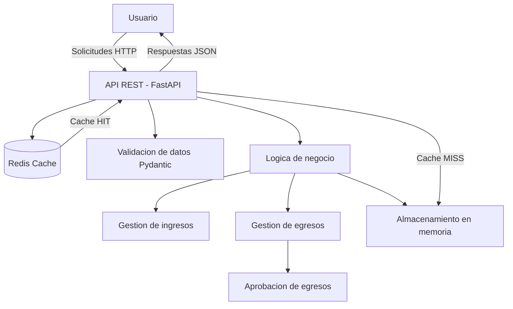

# Arquitectura del Sistema

## Descripción de la Arquitectura

SIMAF está basado en una arquitectura cliente-servidor utilizando una API REST desarrollada con FastAPI. Esta arquitectura permite separar la capa de presentación del procesamiento de datos, facilitando la escalabilidad y el mantenimiento del sistema.

El sistema expone endpoints HTTP que permiten gestionar el flujo principal del negocio: registro de ingresos, registro de egresos, aprobación de egresos y consulta de información. Estos endpoints pueden ser consumidos mediante herramientas como Swagger UI o cualquier cliente HTTP.

Para el MVP, los datos se almacenan en memoria utilizando estructuras simples, lo que permite enfocarse en la lógica del negocio sin depender de una base de datos externa.

---

## Responsabilidades por Bloque

- **Cliente (Usuario):**
  Realiza solicitudes HTTP a la API para interactuar con el sistema.

- **API REST (FastAPI):**
  Recibe las solicitudes, valida los datos de entrada y retorna respuestas en formato JSON.

- **Validación (Pydantic):**
  Se encarga de validar los datos enviados en las solicitudes, asegurando que cumplan con el formato esperado.

- **Lógica de Negocio:**
  Procesa las operaciones principales del sistema, como registrar ingresos, gestionar egresos y aprobar transacciones.

- **Almacenamiento en Memoria:**
  Guarda temporalmente la información de ingresos y egresos durante la ejecución del sistema.

- **Redis (Capa de Cache):**
  Se incorpora como una mejora de rendimiento utilizando el patrón cache-aside para almacenar respuestas frecuentes del endpoint de consulta de egresos.

---

## Diagrama de Arquitectura

## Decisiones Arquitectónicas

### Uso de FastAPI
Se eligió FastAPI por su alto rendimiento, simplicidad y generación automática de documentación (Swagger), lo que facilita el desarrollo y las pruebas del sistema.

---

### Almacenamiento en Memoria
Se utiliza memoria como fuente de datos en el MVP con el objetivo de simplificar la implementación y evitar la complejidad de una base de datos en esta etapa inicial.

---

### Redis como Cache
Se implementa Redis utilizando la estrategia **cache-aside**, la cual funciona de la siguiente manera:

- Primero se consulta Redis.
- Si el dato existe → **CACHE HIT** (respuesta inmediata).
- Si el dato no existe → **CACHE MISS** → se consulta la memoria.
- Luego el resultado se guarda en Redis para futuras consultas.

---

### TTL en Redis
Se define un TTL de **60 segundos**, con el objetivo de evitar la permanencia de datos obsoletos en cache y asegurar cierta actualización de la información.

---

### Ubicación de Redis en la arquitectura
Redis se ubica como una capa intermedia entre la API y la fuente de datos, actuando como acelerador de consultas frecuentes y reduciendo la carga sobre la lógica principal del sistema.

---

### Responsabilidad de Redis
Redis tiene las siguientes responsabilidades dentro del sistema:

- Almacenar datos consultados frecuentemente.
- Reducir la latencia en las respuestas.
- Implementar el patrón cache-aside.
- Gestionar la expiración de datos mediante TTL.
- Mejorar el rendimiento general del sistema.

---

### Ausencia de autenticación en el MVP
No se implementa un sistema de autenticación en esta versión del MVP con el fin de mantener el enfoque en la lógica principal del sistema. La seguridad y gestión de usuarios se consideran para versiones futuras.
